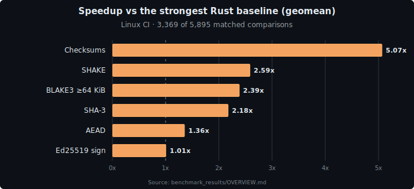

# rscrypto

[](https://crates.io/crates/rscrypto)
[](https://docs.rs/rscrypto)
[](https://github.com/loadingalias/rscrypto/actions/workflows/ci.yaml)
[](Cargo.toml)
[](#license)

**Pure Rust cryptography for systems code: small builds, hardware acceleration, `no_std`, and no mandatory dependency stack.**

`rscrypto` is one crate for the primitive families systems projects actually stitch together: hashes, MACs, KDFs, password hashing, signatures, key exchange, AEAD encryption, checksums, and fast non-cryptographic hashes.

Use a leaf feature for one primitive. Use `full` for the whole toolbox. No C. No FFI. No OpenSSL. No default third-party dependencies.

<p align="center">
  
</p>

<p align="center">
  <i>Latest 2026-05-17 Linux CI benchmark pass. Values above <code>1.00x</code> mean <code>rscrypto</code> is faster than the fastest matched Rust baseline.</i>
</p>

## Why rscrypto?

- **One coherent primitive stack.** Avoid composing half a dozen crates with different APIs, feature models, and security conventions.
- **Small builds stay small.** Enable `sha2`, `blake3`, `aes-gcm`, `chacha20poly1305`, `ed25519`, `x25519`, `argon2`, or any other leaf without pulling in the world.
- **Portable Rust is the source of truth.** SIMD and ASM paths are accelerators; the portable backend remains the reference implementation.
- **Hardware dispatch is built in.** x86/x86_64, Arm/AArch64, Apple Silicon, IBM Z, POWER, RISC-V, and WASM all have portable fallbacks, with optimized kernels where they pay.
- **`no_std` is a first-class target.** Server, CLI, embedded, bare-metal, and WASM builds use the same crate surface.
- **Audit knobs are explicit.** `portable-only` forces runtime dispatch to the audited portable backend; `getrandom`, `serde`, and `rayon` are opt-in.
- **Security hygiene is part of the API.** Opaque verification errors, constant-time equality, zeroized secret types, strict arithmetic, official vectors, fuzzing, Miri, and cross-CPU CI are built into the project discipline.

`rscrypto` is a primitives crate. It is **not** a TLS stack, PKI toolkit, protocol implementation, or FIPS 140-3 validated module.

## Install

Minimal `no_std` SHA-2 build:

```toml
[dependencies]
rscrypto = { version = "0.2.0", default-features = false, features = ["sha2"] }
```

Full toolbox with OS randomness enabled:

```toml
[dependencies]
rscrypto = { version = "0.2.0", features = ["full", "getrandom"] }
```

Use `default-features = false` for constrained `no_std` builds. Enable `getrandom` only when you need APIs that generate salts, keys, or nonces from the operating system.

## Quick Start

```rust
use rscrypto::{Digest, Sha256};

let one_shot = Sha256::digest(b"hello world");

let mut h = Sha256::new();
h.update(b"hello ");
h.update(b"world");

assert_eq!(h.finalize(), one_shot);
```

The common API shape is deliberately boring: one-shot when convenient, streaming when needed.

## Encrypt Data

```toml
[dependencies]
rscrypto = { version = "0.2.0", default-features = false, features = ["chacha20poly1305"] }
```

```rust
use rscrypto::{Aead, ChaCha20Poly1305, ChaCha20Poly1305Key, aead::Nonce96};

let key = ChaCha20Poly1305Key::from_bytes([0x11; 32]);
let nonce = Nonce96::from_bytes([0x22; Nonce96::LENGTH]);
let cipher = ChaCha20Poly1305::new(&key);

let aad = b"transfer:v1";
let mut message = *b"pay bob 10";

let tag = cipher
  .encrypt_in_place(&nonce, aad, &mut message)
  .expect("encryption succeeds");

cipher
  .decrypt_in_place(&nonce, aad, &mut message, &tag)
  .expect("authentication succeeds");

assert_eq!(&message, b"pay bob 10");
```

## Hash Passwords

```toml
[dependencies]
rscrypto = { version = "0.2.0", default-features = false, features = ["argon2", "phc-strings", "getrandom"] }
```

```rust
use rscrypto::{Argon2Params, Argon2VerifyPolicy, Argon2id};

let password = b"correct horse battery staple";
let params = Argon2Params::new().build().expect("valid Argon2 params");
let encoded = Argon2id::hash_string(&params, password).expect("password hash created");

assert!(
  Argon2id::verify_string_with_policy(
    password,
    &encoded,
    &Argon2VerifyPolicy::default(),
  )
  .is_ok()
);
```

## What You Get

| Need | Included | Feature path |
|---|---|---|
| Cryptographic hashes | SHA-2, SHA-3, SHAKE, cSHAKE256, BLAKE2, BLAKE3, Ascon-Hash/XOF/CXOF | `hashes` or leaf features |
| MACs and KDFs | HMAC-SHA-2, KMAC256, HKDF-SHA-2, PBKDF2-HMAC-SHA-2 | `auth` or leaf features |
| Password hashing | Argon2d/i/id, scrypt, PHC string encode/verify | `auth`, `argon2`, `scrypt`, `phc-strings` |
| Public-key primitives | Ed25519 signatures, RSA signing/verification/OAEP/RSAES-PKCS1-v1_5/key generation, X25519 key exchange | `auth`, `signatures`, `ed25519`, `rsa`, `x25519` |
| AEAD encryption | AES-128/256-GCM, AES-128/256-GCM-SIV, ChaCha20-Poly1305, XChaCha20-Poly1305, AEGIS-256, Ascon-AEAD128 | `aead` or leaf features |
| Checksums | CRC-16, CRC-24, CRC-32, CRC-32C, CRC-64/XZ, CRC-64/NVMe | `checksums` or leaf features |
| Fast non-crypto hashes | XXH3-64/128, RapidHash 64/128 | `xxh3`, `rapidhash` |

Fast non-cryptographic hashes and CRCs are for indexing, checksumming, deduplication, and integrity plumbing. Do not use them for passwords, signatures, MACs, key derivation, or authentication.

Feature flags are layered deliberately:

- **Leaf primitives:** `sha2`, `blake3`, `aes-gcm`, `ed25519`, `x25519`, `crc32`, and similar.
- **Families:** `hashes`, `checksums`, `macs`, `kdfs`, `password-hashing`, `aead`, `signatures`, `key-exchange`.
- **Deployment controls:** `std`, `alloc`, `getrandom`, `parallel`, `serde`, `serde-secrets`, `portable-only`.

Full feature inventory: [`docs/features.md`](docs/features.md). Public type inventory: [`docs/types.md`](docs/types.md).

## Performance

Latest public benchmark pass: 2026-05-17, commit `1c30a68`, nine Linux CI runners plus one local macOS Apple Silicon run. Speedup is `external_crate_time / rscrypto_time` for latency rows and equivalent throughput ratio for throughput rows; values above `1.00x` mean `rscrypto` is faster.

| Area | Compared against | Result |
|---|---|---:|
| **Linux CI fastest external** | strongest matched Rust baseline per case | **1.52x geomean** |
| Linux CI scorecard | fastest external | **3,807 wins / 6,552 pairs** |
| Full current corpus | Linux CI + local Apple Silicon | **1.51x geomean** |
| Checksums | `crc`, `crc32fast`, `crc64fast`, `crc-fast` | **5.10x geomean** |
| SHA-3 / SHAKE | RustCrypto `sha3` | **2.17x / 2.60x geomean** |
| BLAKE3, `>=64 KiB` | `blake3` | **2.38x geomean** |
| AEAD | RustCrypto AEADs, `aegis`, `ring`, `aws-lc-rs` | **1.37x geomean** |
| HMAC-SHA384 / HMAC-SHA512 | `ring`, RustCrypto, AWS-LC | **1.23x / 1.23x geomean** |
| macOS Apple Silicon local | fastest matched Rust baseline per case | **1.35x geomean** |
| macOS Ed25519 verify | fastest matched Rust baseline per case | **1.01x geomean** |

The honest weak spots right now: password hashing is the new broad pressure point at 0.81x across Linux CI fastest-external rows, PBKDF2-SHA256 at `iters=1` is 0.77x, Linux CI Ed25519 verify is 0.95x, local Apple Silicon Ed25519 signing is 0.66x, and sustained AES-GCM on POWER10/RISC-V is not competitive. See [`benchmark_results/OVERVIEW.md`](benchmark_results/OVERVIEW.md) for raw runs, methodology, platform scorecards, and loss tables.

## Portability And Acceleration

`rscrypto` keeps the portable Rust path as the byte-for-byte authority. ISA-specific kernels are selected only when the target and runtime CPU support them.

| Target family | Acceleration examples |
|---|---|
| x86 / x86_64 | SSE4.2, AVX2, AVX-512, AES-NI, SHA-NI, VAES, VPCLMULQDQ |
| Arm / AArch64 / Apple Silicon | NEON, AES, PMULL, SHA2, SHA3, SVE2-PMULL |
| IBM Z | CPACF, MSA, VGFM |
| POWER / ppc64le | POWER8/9/10 vector and crypto extensions |
| RISC-V | RVV, Zbc, Zvkned, Zvbc |
| WASM | SIMD128 where available, portable fallback everywhere |

Use `portable-only` when you need deterministic dispatch, audit-constrained builds, or a portable backend only.

Full platform matrix: [`docs/platforms.md`](docs/platforms.md). Architecture notes: [`docs/architecture.md`](docs/architecture.md).

## Security Posture

- Constant-time MAC, AEAD, and signature verification.
- Opaque verification errors that avoid leaking failure details.
- Secret-bearing types zeroize on drop and mask `Debug`.
- Strict arithmetic for counters, lengths, offsets, and indices.
- AEAD failed-open paths wipe output buffers.
- Portable and accelerated backends are differentially tested for byte-identical output.
- Official test vectors, fuzz corpus replay, Miri, `cargo deny`, and `cargo audit` run in CI.

Read [`docs/security.md`](docs/security.md) before shipping cryptographic code. For compliance posture, see [`docs/compliance.md`](docs/compliance.md).

Vulnerabilities should be reported through [GitHub Private Vulnerability Reporting](https://github.com/loadingalias/rscrypto/security/advisories/new) or the process in [`SECURITY.md`](SECURITY.md).

## Documentation

- API reference: [docs.rs/rscrypto](https://docs.rs/rscrypto)
- Examples: [`examples/`](examples/)
- Feature flags: [`docs/features.md`](docs/features.md)
- Public type inventory: [`docs/types.md`](docs/types.md)
- Platform matrix: [`docs/platforms.md`](docs/platforms.md)
- Security guidance: [`docs/security.md`](docs/security.md)
- Migration guides: [`docs/migration/`](docs/migration/)
- Benchmark methodology: [`docs/benchmarking.md`](docs/benchmarking.md)
- Benchmarks: [`benchmark_results/OVERVIEW.md`](benchmark_results/OVERVIEW.md)
- Release history: [`CHANGELOG.md`](CHANGELOG.md)

## MSRV

Rust **1.91.0**.

The pinned nightly in [`rust-toolchain.toml`](rust-toolchain.toml) is used for Miri, fuzzing, and exotic-architecture checks.

## License

Dual-licensed under [Apache-2.0](LICENSE-APACHE) or [MIT](LICENSE-MIT), at your option.
