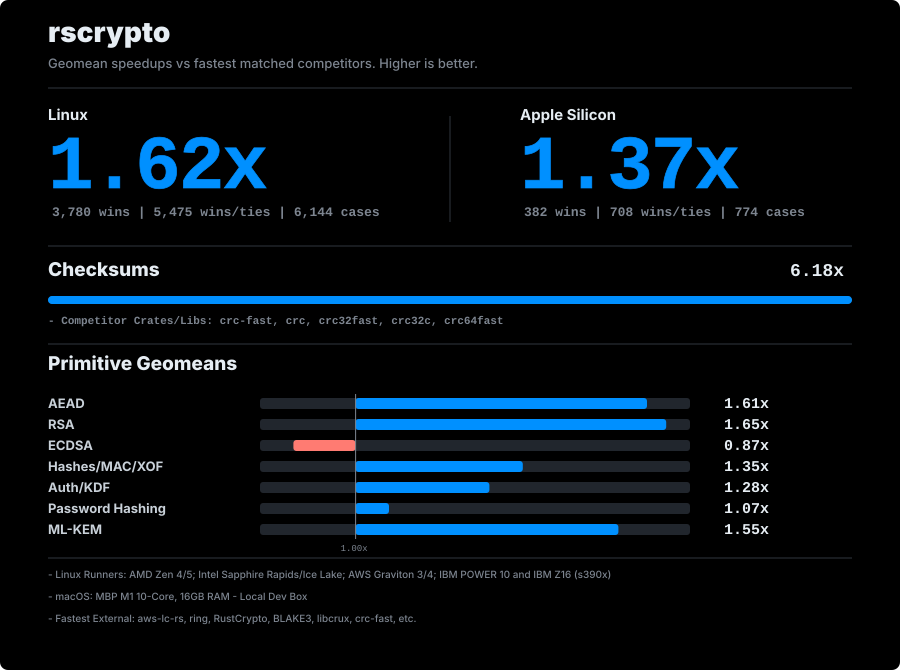

# rscrypto

[](https://crates.io/crates/rscrypto)
[](https://docs.rs/rscrypto)
[](https://github.com/loadingalias/rscrypto/actions/workflows/ci.yaml)
[](https://github.com/loadingalias/rscrypto/actions/workflows/rsa.yaml)
[](Cargo.toml)
[](#license)

`rscrypto` provides pure Rust cryptographic primitives, cryptographic and fast
hashes, password hashing, and checksums behind one feature model.

It has no production C/FFI, OpenSSL, or system-library dependency. Enable one
leaf feature for one primitive, an umbrella feature for a family, or `full` for
the complete primitive surface. Every supported target retains the portable
Rust backend; SIMD and assembly only accelerate it.

## Scope

- One feature model for hashes, MACs, KDFs, password hashing, AEADs,
  signatures, key exchange, ML-KEM, RSA, and checksums.
- No OpenSSL or production C/FFI dependency.
- Concrete types, scoped errors, typed keys/nonces/tags, and opaque
  verification failures across the supported primitives.
- Portable Rust implementations are the reference path; SIMD and ASM are
  accelerators tested against that path.
- `no_std`, WASM, server, CLI, embedded, and audit-constrained builds use the
  same leaf-feature model.
- Public validation evidence covers vectors, differential tests, fuzz corpus
  replay, Miri, backend equivalence, and scoped constant-time release gates.

`rscrypto` is a primitives crate. It is not a TLS stack, PKI toolkit, key
store, or protocol implementation. It does not claim FIPS 140-3 validation, a
third-party audit, formal verification, or whole-crate constant-time behavior.

## Choose features

Minimal `no_std` SHA-2 build:

```toml
[dependencies]
rscrypto = { version = "0.8.1", default-features = false, features = ["sha2"] }
```

Full primitive stack with OS randomness enabled:

```toml
[dependencies]
rscrypto = { version = "0.8.1", features = ["full", "getrandom"] }
```

Use `default-features = false` for `no_std` builds. Enable `getrandom` only for
APIs that obtain salts, keys, nonces, or RSA key-generation entropy from the
operating system. See [`docs/features.md`](docs/features.md) for exact feature
dependencies and deployment controls.

## Quick start

```rust
use rscrypto::Sha256;

let one_shot = Sha256::digest(b"hello world");

let mut h = Sha256::new();
h.update(b"hello ");
h.update(b"world");

assert_eq!(h.finalize(), one_shot);
```

The common API shape is one-shot when convenient and streaming when needed.

## Common workflows

| Task | Features | Start here |
|---|---|---|
| AEAD seal/open | `chacha20poly1305`, `getrandom` | [`examples/aead_seal_open.rs`](examples/aead_seal_open.rs) |
| Ed25519 and ECDSA signatures | `ed25519`, `ecdsa-p256`, `getrandom` | [`examples/signatures.rs`](examples/signatures.rs) |
| RSA-PSS verification | `rsa` | [`examples/rsa_pss_verify.rs`](examples/rsa_pss_verify.rs) |
| ML-KEM shared secret | `ml-kem`, `getrandom` | [`examples/mlkem_encapsulation.rs`](examples/mlkem_encapsulation.rs) |
| Argon2id and scrypt password hashing | `password-hashing`, `getrandom` | [`examples/password_hashing.rs`](examples/password_hashing.rs) |

Use [`docs/types.md`](docs/types.md) when you need the full type map, and
[`docs/features.md`](docs/features.md) when you need the smallest feature set.

## Capabilities

| Need | Included | Feature path |
|---|---|---|
| Cryptographic hashes | SHA-2, SHA-3, SHAKE, cSHAKE128/256, BLAKE2, BLAKE3, Ascon-Hash/XOF/CXOF | `hashes` or leaf features |
| MACs and KDFs | HMAC-SHA-2/SHA-3, KMAC128/256, standalone Poly1305, HKDF-SHA-2, PBKDF2-HMAC-SHA-2 | `macs`, `kdfs`, or leaf features |
| Password hashing | Raw Argon2d/i/id and scrypt KDFs; generated, bounded PHC password records | `password-hashing` or leaf features |
| Public-key primitives | ECDSA P-256/P-384 signing/verification, Ed25519 signatures, RSA signing/verification/OAEP/RSAES-PKCS1-v1_5/key generation, X25519 key exchange, ML-KEM-512/768/1024 KEMs | `signatures`, `key-exchange`, or leaf features |
| AEAD encryption | AES-128/256-GCM, AES-128/256-GCM-SIV, ChaCha20-Poly1305, XChaCha20-Poly1305, AEGIS-256, Ascon-AEAD128 | `aead` or leaf features |
| Checksums | CRC-16, CRC-24, CRC-32, CRC-32C, CRC-64/XZ, CRC-64/NVMe | `checksums` or leaf features |
| Fast hashes | XXH3-64/128, RapidHash V3-64 | `xxh3`, `rapidhash` |

Feature layers:

- Leaf primitives: `sha2`, `blake3`, `aes-gcm`, `ed25519`, `x25519`,
  `ml-kem`, `crc32`, and the other algorithm features.
- Families: `hashes`, `checksums`, `macs`, `kdfs`, `password-hashing`,
  `aead`, `signatures`, and `key-exchange`.
- Deployment controls: `std`, `alloc`, `getrandom`, `parallel`, `serde`, and
  `portable-only`. `serde-secrets` explicitly opts secret material into Serde.

See the complete [`feature inventory`](docs/features.md) and
[`public type inventory`](docs/types.md).

## Security

Constant-time claims are release-bound and configuration-specific. A claim
exists only when the matching signed GitHub release includes an attested
`rscrypto-X.Y.Z-ct-evidence.tar.gz` bundle whose required gates pass for the
exact version, commit, target, profile, and feature set. [`ct.toml`](ct.toml)
records candidate surfaces; it does not establish a claim by itself.

Secret-bearing fixed-size owners do not implement `PartialEq` or `Eq`. Their
`ct_eq` methods return an opaque `CtDecision`; callers must explicitly consume
it with `declassify()` to obtain a branchable bit. Verification APIs keep that
boundary internal and return one opaque `Result`. This is misuse resistance at
the Rust API boundary, not proof about downstream machine code.

Public parsing, unlisted key gen, OS randomness, raw hashes, checksums,
non-cryptographic hashes, benchmark paths, and public-key verification math are
outside that claim. Releases through `v0.6.4` contain no CT evidence bundle and
carry no release-bound constant-time claim.

The fixed-size secret owners named in
[`docs/secret-ownership.md`](docs/secret-ownership.md) overwrite their owned
bytes on drop and mask `Debug`; the claim does not extend to caller copies.
Verification failures use opaque errors, and failed AEAD opens clear caller
output buffers. Release artifacts are signed-tag gated, published through
crates.io Trusted Publishing, and covered by GitHub build provenance
attestations.

No third-party audit, FIPS 140-3 certificate, or formal whole-crate proof is
claimed. Read the exact [constant-time model](docs/constant-time.md),
[threat model](THREAT_MODEL.md), and [compliance boundary](docs/compliance.md)
before making a security or assurance claim. Report vulnerabilities through
[GitHub Private Vulnerability Reporting](https://github.com/loadingalias/rscrypto/security/advisories/new)
or [`SECURITY.md`](SECURITY.md), not public issues.

## Platforms

The portable Rust implementation is the byte-for-byte authority. Compile-time
target support and, with `std`, detected runtime CPU capabilities select
eligible SIMD or assembly kernels. Unsupported acceleration falls back to
portable Rust.

See [`docs/platforms.md`](docs/platforms.md) for the dispatch model, target
matrix, and `no_std` coverage. See
[`docs/features.md#portable-only`](docs/features.md#portable-only) before using
`portable-only`; it constrains runtime dispatch but does not remove accelerated
code from a binary.

## Performance

The 2026-08-18 snapshot covers eight Linux CI runners at commit `7eb44e9`. The
RustCrypto HMAC-SHA-256 key setup is now hoisted out of the timed loop, matching
the reusable keyed state given to rscrypto, `ring`, and AWS-LC, so these
aggregates are equivalent-work claims. Ratios are `external / rscrypto`; higher
is better.

<p align="center">
  
</p>

3,780 of 6,144 fastest-external comparisons are wins and 5,475 are wins or ties,
for a 1.62x Linux geomean. Known losses: ECDSA P-256/P-384 regressed sharply on
IBM z16/s390x in this run and drags every ECDSA aggregate below parity (0.87x
across 128 rows; 1.19x-1.53x excluding that one runner), and
`rapidhash-stream/one-write` trails the `rapidhash` crate at 0.87x, mostly on
x86_64.

Use individual shape-compatible rows for investigation and benchmark the
deployment workload on its target hardware. Raw results, methodology, and the
full loss list are in
[`benchmark_results/OVERVIEW.md`](benchmark_results/OVERVIEW.md) and
[`docs/benchmarking.md`](docs/benchmarking.md).

## Docs

- Start: [docs.rs](https://docs.rs/rscrypto), [`examples/`](examples/),
  [`docs/features.md`](docs/features.md), [`docs/types.md`](docs/types.md)
- Security and review: [`SECURITY.md`](SECURITY.md),
  [`THREAT_MODEL.md`](THREAT_MODEL.md), [`docs/constant-time.md`](docs/constant-time.md),
  [`docs/compliance.md`](docs/compliance.md)
- Evidence: [`docs/test-vector-coverage.md`](docs/test-vector-coverage.md),
  [`docs/platforms.md`](docs/platforms.md),
  [`benchmark_results/OVERVIEW.md`](benchmark_results/OVERVIEW.md)
- Switching crates: [`docs/migration/`](docs/migration/)
- Contributing: [`CONTRIBUTING.md`](CONTRIBUTING.md)
- Releases: [`CHANGELOG.md`](CHANGELOG.md), [`docs/release.md`](docs/release.md)

## MSRV

The minimum supported Rust version is **1.91.0**.

The pinned stable development toolchain in
[`rust-toolchain.toml`](rust-toolchain.toml) is separate from the MSRV.
Nightly-only Miri, fuzzing, and architecture checks use the dated exception in
[`toolchains.toml`](.config/toolchains.toml).

## License

Dual-licensed under [Apache-2.0](LICENSE-APACHE) or [MIT](LICENSE-MIT), at your option.
